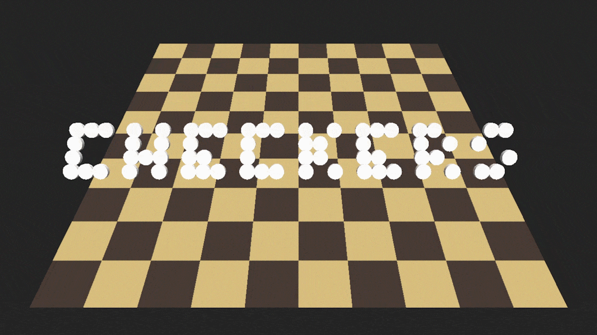

# SDL-Checkers

## Introduction

This project is a checkers game built with SDL2 in C++.

## Rules

Game rules are taken from the international variant of draughts.

* Pieces move and capture diagonally
* Dark squares only
* Board size is 10x10
* Backwards capture is possible
* Knight pieces can fly
* Forced capturing

## Features

* Game Loop
* Camera movement
* Dynamic lighting
* Smooth shading
* Mesh generation
* Game states
* Piece movement
* Piece capturing
* Piece types
  * Man Piece
  * Knight Piece
* Win/Loose conditions

## Technologies

* [SDL2](https://www.libsdl.org/)
* [GLM](https://github.com/g-truc/glm)

## Requirements

* [Visual C++](https://visualstudio.microsoft.com/pl/)