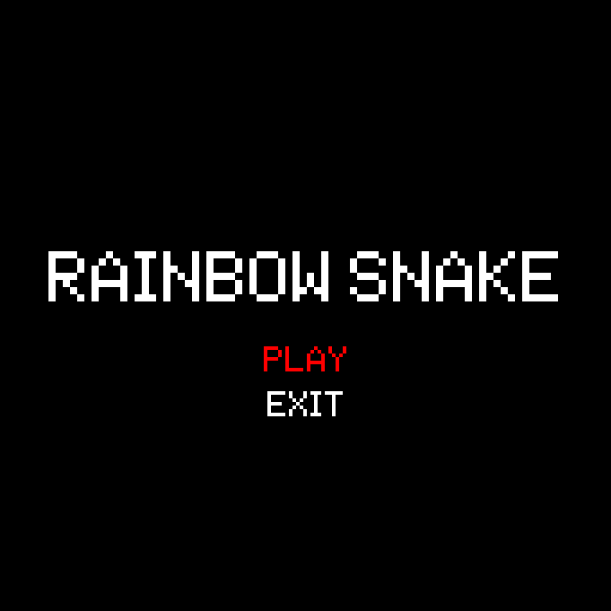
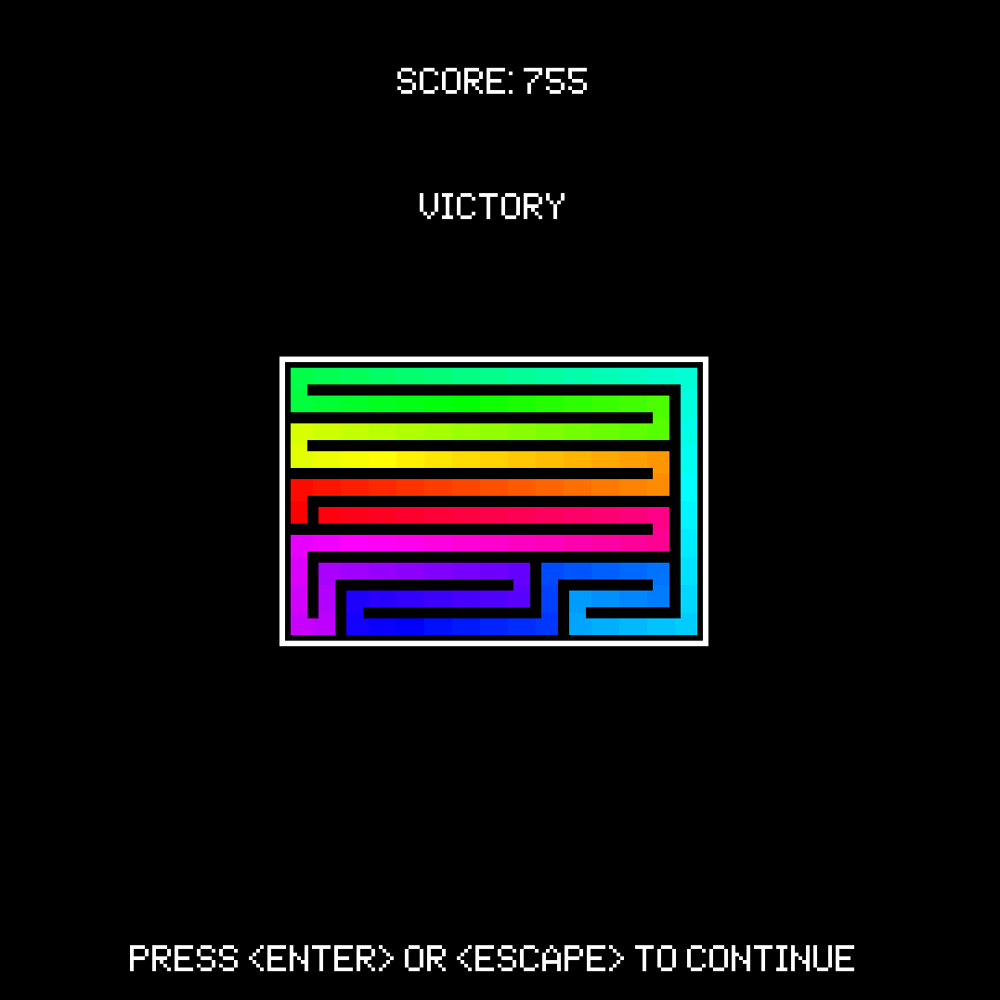

# Rainbow snake

## Overview
Simple snake game, nothing too crazy, only some colour - great for a quick and relaxing game. Make as a learning exercise for C and SDL2.
Game is available on my [itch.io page](https://solaire.itch.io/rainbow-snake)

Features
- Rainbow gradient (150 colors)
- 12 difficulty levels (snake updates per second)
- Victory condition
- Defeat delay frame - basically the player will get an extra frame to react before defeat is registered (makes the game less annoying at higher levels)
- Small size (less than 1MB)

## Using
Download a release from the releases page. The game works on Windows and Linux (tested on Win10 and ubuntu respectively) - feel free to make a Mac-friendly version

## Building from source
The game has been written using Code::Blocks IDE and both Windows and Linux have their own Debug and Release builds.
- For least pain, load the C::B project and build selected version
- You can use the makefiles (makefile_win32 and makefile_unix) but they have not been tested
- You will need to copy the font.ttf into the directory with the game
  - For Windows builds, you'll also need to copy the SDL2/SDL2_TTF runtime dependencies.

## Contributing
You can support the project in the following ways:
- Go to [Issues](https://github.com/Solaire/RainbowSnake/issues) to identify bugs or make suggestions;
- Fork the repo, make some changes, and submit a pull request.

## [License](LICENSE)
GNU General Public License v3.0

