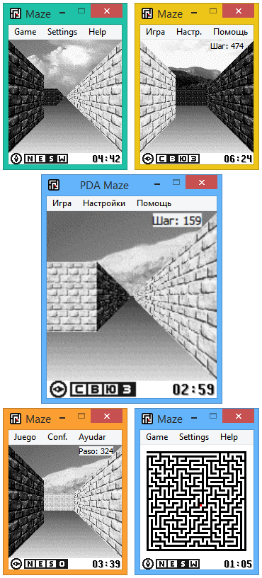
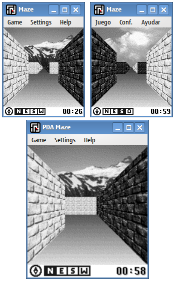
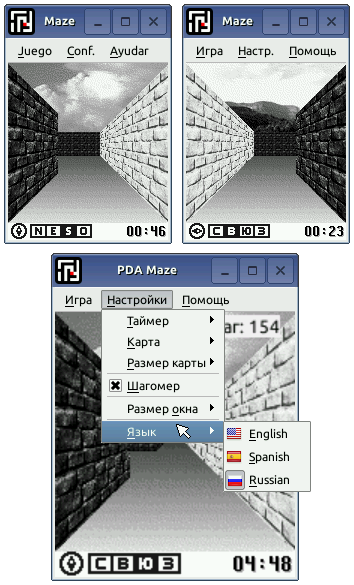
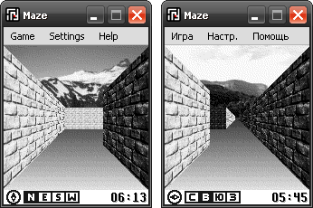
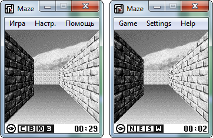

PDA Maze
=============

PDA Maze is rewrite Bill Kendrick's and Robert Ernst maze game to modern Qt library (4.x.x, 5.x.x versions).

Added:

1. New Compass Indicator;

2. Step Indicator;

3. Screen scale function with smoothing;

4. Translated into English, Russian and Spanish.

Fixed many graphical glitches.

## Screens:

Windows 8.1:

Linux Mint 15 KDE 64-bit:

Linux Embedded ARM Arch:

Windows XP (Zune theme):

Windows 7:

